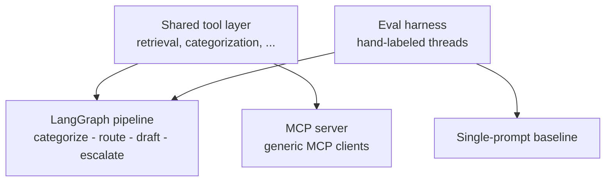
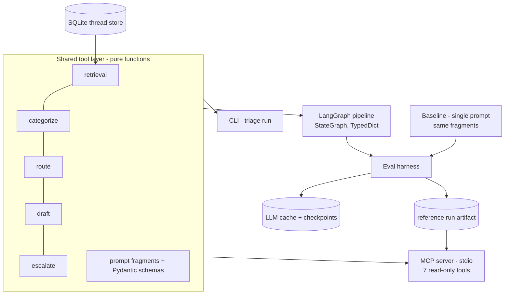
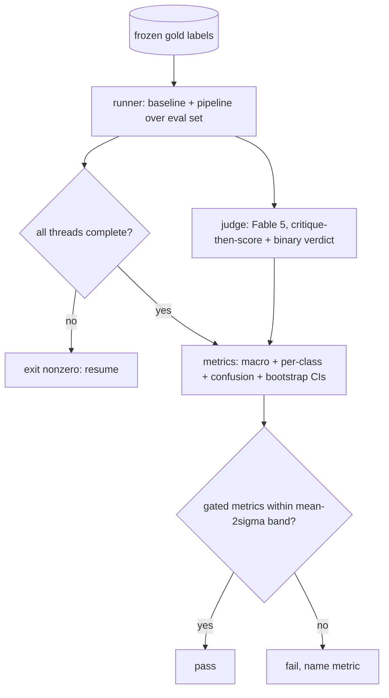

# Customer Feedback Triage Agent - Plan

## Goal Capsule

- **Objective:** Ship a publicly inspectable customer-feedback triage system — LangGraph pipeline, MCP server, quantified eval harness, case-study README — over real Twitter support data, by 2026-08-24.
- **Product authority:** This plan. The repo is new and empty; no STRATEGY.md or prior artifacts exist. This is the sole active work unit — no surrounding areas were split off.
- **Authority hierarchy:** Product Contract requirements govern behavior; Key Technical Decisions govern mechanism within their cited requirements; Implementation Units override neither.
- **Execution profile:** Deterministic modules (thread reconstruction, metrics, regression logic) are built test-first; LLM-calling code is developed against the dev model profile or mocks (R30) and smoke-verified; measurement runs use the recorded-run model pair only.
- **Stop conditions:** Stop and surface to the user if the dataset authenticity check fails (R2), if measured API spend is on track to exceed $100, or if the schedule forces cuts beyond the agreed ladder (eval-set size to ~80 floor, then the terminal recording — judge validation, the regression check, MCP, and core eval are never cut). The protected core-eval scope includes the full metrics output: confusion matrix, bootstrap confidence intervals, and per-class tables are not separable addenda.
- **Tail ownership:** The executor owns commits, verification, and the shipping tail; the license-check outcome (R29) selects the eval-set distribution mode without pausing the run.

---

## Product Contract

### Summary

A triage system that takes messy real customer-support threads (Kaggle `twcs` dataset) and runs each through a four-step LangGraph pipeline — categorize, route, draft, escalate — with the tool layer also exposed via an MCP server, measured against a hand-labeled eval set with a single-prompt baseline comparison, and delivered as a headless CLI plus a case-study README. The MCP server and the eval harness are the load-bearing components; the pipeline is functional infrastructure.

### Problem Frame

The author's production agentic work — LangGraph orchestration with real operational metrics — is proprietary client and employer code that no reviewer can inspect. A resume claim that cannot be verified reads the same as one that is untrue. Two specific capabilities are additionally absent from that work history altogether: protocol-level tool exposure (MCP) and formal quantified evaluation of an LLM system. An AI/LLM-engineer reviewer screening the portfolio has no way to check any of this today.

The demo domain carries a real problem of its own: raw multi-brand customer support traffic is messy — fragmented conversation threads, vague complaints, mixed intents — and triaging it (what is this really about, who should handle it, does it need a human now) is exactly the kind of work a single prompt handles poorly and a measured multi-step system can be shown to handle better.

### Key Decisions

- **Dataset: Customer Support on Twitter (`twcs`) over CFPB complaints** (session-settled: user-directed — chosen over CFPB: cross-industry, conversational, real scraped traffic; accepts losing CFPB's escalation ground-truth proxy). Governs R1, R18.
- **Threads, not isolated tweets, are the unit of diagnosis** (session-settled: user-directed — chosen over per-tweet triage: single tweets are too short to carry root cause). Governs R1.
- **Predefined generic cross-industry taxonomy; taxonomy discovery cut entirely** (session-settled: user-directed — chosen over a discovery-derived taxonomy: `twcs` spans dozens of brands with no shared team structure, so a generic queue set designed to generalize to a single company's support org is the honest shape; applies to both categorization and routing). Governs R4.
- **Single-prompt baseline is the "before" in the before/after story** (session-settled: user-approved — chosen over pipeline-v1-vs-v2: directly justifies why multi-step orchestration exists). Governs R8, R17.
- **Draft step is measured via a human-validated LLM judge, not demo-only** (session-settled: user-directed — chosen over exempting drafts from the eval: the README claims a measured system across the pipeline, and exempting one step undermines that). Governs R13, R14, R22.
- **CLI plus terminal recording over a Streamlit UI** (session-settled: user-directed — chosen over the originally specified Streamlit demo: the target reader is an AI/LLM engineer, not a recruiter clicking a UI; effort stays on MCP and eval rigor). Governs R7, R19.
- **MCP server and eval harness are load-bearing; LangGraph pipeline is functional, not a showcase** (session-settled: user-directed — production work already proves the orchestration claim; MCP and formal eval appear nowhere in the existing work history). Governs R9, R16.
- **Hard ship date 2026-08-24, with an agreed cut ladder** (session-settled: user-directed): if behind schedule, cut in this order — (1) shrink the eval set toward the 100 floor, hard minimum ~80, below which precision/recall stops being meaningful; (2) the terminal recording, last if ever. Judge validation and the regression check (R15) are protected at the same priority as the MCP server and core classification eval and are not on the ladder. Governs R11, R15, R19.

### Actors

- A1. **Portfolio reader** — an AI/LLM engineer evaluating the author's work; reads the README, may clone and run the CLI or eval, may connect an MCP client.
- A2. **Operator** — the author (and any cloner) running ingestion, triage, and eval runs from the CLI.
- A3. **MCP client** — any generic MCP-capable host (e.g., Claude Desktop) consuming the exposed tools without touching the pipeline.

### Requirements

**Data**

- R1. Ingest the Kaggle Customer Support on Twitter dataset (`thoughtvector/customer-support-on-twitter`) and reconstruct full conversation threads via the reply-chain fields; the reconstructed thread is the unit of triage everywhere downstream.
- R2. Before labeling or measurement begins, confirm the dataset is real scraped support traffic, not synthetic, and check whether its license permits redistributing a small labeled subset; record both outcomes in the README's data section. The license outcome selects R29's distribution mode before any eval-set storage is committed.
- R31. Thread reconstruction is a deterministic, documented contract: walk parent links to the root or to the first missing parent (flagging truncation); the thread is the single root-to-leaf branch containing the requested tweet plus direct brand replies, in chronological order; cycles are guarded by a visited set and flagged; sibling replies from other customers are excluded.

**Triage pipeline**

- R3. A LangGraph pipeline processes one thread through four distinct steps — categorize, route, draft, escalate — each a separate node with its own inputs and outputs, not a single prompt.
- R4. Categorize and route assign labels from predefined, generic, cross-industry label sets designed to generalize to a single company's support org (indicative queue set: Billing/Payments, Technical/Product, Shipping/Delivery, Account/Access, Complaint/Escalation, General Inquiry); final label sets are settled at planning.
- R5. Escalate produces a binary needs-human-attention decision per thread with a stated reason.
- R6. Draft produces a reply draft for every thread, including escalated ones; nothing is ever sent — all output is for human review.
- R7. A headless CLI entrypoint runs a thread (or batch) end-to-end and emits the structured triage result as JSON, with distinct exit codes for success, pipeline failure, and input error; batch runs continue past per-thread failures and exit nonzero if any failed.
- R28. Degenerate threads reachable via CLI or MCP (single-tweet, empty-after-cleaning, deflect-to-DM, or otherwise undiagnosable content) still produce a valid result: General Inquiry plus escalation=true with a stated insufficient-content reason. No extra taxonomy label is introduced; non-English handling is whatever the model produces, disclosed in limitations.

**Baseline**

- R8. A single-prompt baseline produces the same four outputs in one LLM call, on the same model and settings as the pipeline, with its prompt assembled from the same shared instruction fragments the pipeline steps use (equal-information comparison); it is the "before" in every before/after comparison.

**MCP server**

- R9. An MCP server exposes the system's tool layer to generic MCP clients over stdio: seven read-only tools — thread discovery (list/search), thread retrieval, categorize, route, draft, assess-escalation, and a zero-LLM-cost eval-report reader over the shipped reference run. Tools carry read-only annotations; classification results return label plus rationale; draft results carry an explicit never-sent status field; the valid label sets are discoverable from tool descriptions. No send/publish capability exists anywhere in the tool layer, and no tool can write gold labels or trigger eval runs.
- R10. The pipeline nodes and the MCP server consume the same underlying tool implementations: one tool layer, two surfaces.



**Eval harness**

- R11. A hand-labeled eval set of 100-150 threads (hard floor ~80 under the cut ladder) carries gold labels for category, route queue, and escalation. Threads are selected by documented criteria: dead-end threads with no diagnosable content (e.g., immediate deflect-to-DM) are excluded, and sampling enforces minimum per-class support across queues and both escalation outcomes. The criteria are disclosed in the README's methodology section as cleaning rules — the raw-data claim survives only if filtering is stated, not silent.
- R12. Each classification step (categorize, route, escalate) reports accuracy, precision, and recall against the eval set, for both baseline and pipeline.
- R13. Draft quality is a distinct score: an LLM-judge rubric scoring 1-5 on four dimensions — correctness relative to the categorized issue, tone appropriateness, absence of hallucinated policy or fact claims, presence of an actionable next step — averaged across the eval set and reported alongside, never blended into, the classification metrics. The judge scores both baseline and pipeline drafts, including escalated threads, outputs its critique before each score, uses anchored scale examples and length-neutral instructions, and additionally emits a binary "would a support lead send this as-is" verdict per draft.
- R14. The judge is validated against a 20-30 example human-labeled subsample (scores plus a one-line critique per score); the judge's few-shot anchor examples come from a separate held-out anchor stock — labeled items beyond the eval set's 80-150 range, never carved from it and never counted in agreement — and agreement is computed only over items the judge never saw as examples, reported as percent-within-one-point, exact agreement, and weighted kappa, with judge-vs-human score distributions, alongside the subsample size. The agreement protocol is frozen before any judge output is inspected. The usability bar is set from the observed rate, not pre-committed; if agreement is weak, the README reports the draft-quality metric as unvalidated rather than presenting it as confirmed.
- R15. A regression check re-runs the eval and fails, naming the metric, when any gated metric drops below its recorded reference by more than the noise tolerance derived per R21. Gated metrics are per-step accuracy, macro-averaged precision/recall per step, and mean draft score; per-class numbers are reported but not gated. For percentage-scale metrics the tolerance is max(2× observed run-to-run spread, 2 percentage points); for mean draft score the tolerance is 2× its own observed spread from the judge-scored variance passes (R21) on the 1-5 scale — no fixed floor is invented for it. When the current run's model IDs, prompt hashes, or eval-set hash differ from the reference, the check emits a hard environment-drift warning distinct from a metric failure.
- R20. Before full eval-set labeling begins, a pilot on ~15-20 threads confirms the pipeline runs end-to-end without errors and produces directionally reasonable output; the gate is functional, not a metric threshold — the sample is too small to prove or disprove lift.
- R21. Before the reference run is recorded, the baseline eval runs 3 times to measure run-to-run variance, and each variance pass judge-scores its baseline drafts so mean draft score has real observed spread; R15's regression tolerances are derived from that observed spread (formula in R15), not invented numbers. Recorded results report mean and spread across runs, not single-run numbers.
- R22. The judge model differs from the draft-generating model and is comparably capable — different to avoid self-preference bias, comparable to avoid trading that bias for a capability-mismatch confound. The constraint is asserted in code from shared config, not maintained by convention.
- R27. A model output that is malformed, off-taxonomy, or refused after schema-enforced retries (two per call) is scored as incorrect — never excluded from metrics — and each system's output-failure rate is reported as its own line in the eval report.
- R30. Development-time and measurement-time model calls are decoupled: all iteration, debugging, and pipeline-logic development runs against a cheap dev model profile or mocked responses; only final recorded runs whose numbers ship in the README use the measurement model pair. Model roles are centralized in one config.
- R32. Eval runs checkpoint per-thread results and are resumable; metrics and regression comparisons are computed only from 100%-complete runs — a partial run exits nonzero with a resume instruction, never a metrics report. The eval command prints its planned call count and rough cost before executing.

**Case-study README**

- R16. The README opens by stating this project's relationship to the author's production experience: production work proved the orchestration claim in practice, but that proof is not independently inspectable; this project is the inspectable counterpart, adding protocol-level tool exposure (MCP) and formal quantified evaluation, on public data because the client work cannot be shown.
- R17. The README reports the before/after comparison — baseline vs pipeline on the same eval set — including all classification metrics, the draft quality score, and the judge agreement rate.
- R18. The README states limitations explicitly, including that escalation labels are fully hand-labeled with no ground-truth proxy in the dataset.
- R19. The README embeds a short terminal recording (or GIF) of one thread running end-to-end through the CLI.
- R23. If the pipeline's measured lift over the baseline is below a stated threshold (value settled at planning), the README ships a written error-analysis section categorizing failure modes — non-optional.
- R24. The README's limitations section states that all gold labels and the judge-validation subsample were produced by a single annotator (the author).

**Reproducibility**

- R25. The README documents the full reproduction path: acquiring the dataset from its Kaggle URL (the raw CSV is hosted directly on Kaggle, uploaded 2017 — no Twitter/X API involved), environment and API-key setup, and the exact commands to run triage, the eval, and the MCP server.
- R26. The repo ships the hand-labeled eval set and the output of one recorded reference run, so the README's numbers are independently checkable.
- R29. Eval-set distribution is dual-mode, selected by R2's license outcome: if redistribution is permitted, the repo ships the labeled threads' full text and the demo, eval, and MCP server work with zero Kaggle dependency; if not, the repo ships IDs and labels only and the README documents regenerating the eval CSV locally from the R25 Kaggle download. The storage layer supports both modes from the start.

### Key Flows

- F1. Triage one thread
  - **Trigger:** Operator invokes the CLI with a thread identifier or raw thread input.
  - **Actors:** A2.
  - **Steps:** Thread is loaded/reconstructed; pipeline runs categorize, route, draft, escalate as separate nodes; structured result is emitted.
  - **Covers:** R1, R3-R7.
- F2. Eval and regression run
  - **Trigger:** Operator invokes the eval command.
  - **Actors:** A2.
  - **Steps:** Baseline and pipeline run over the eval set; classification metrics, draft judge scores, and agreement rate are computed; results are compared against the recorded reference run; regression failures are named.
  - **Covers:** R8, R11-R15.
- F3. MCP client session
  - **Trigger:** A generic MCP client connects to the server.
  - **Actors:** A3.
  - **Steps:** Client lists available tools; calls retrieval to fetch a thread; calls categorization on it; receives the same result the pipeline's node would produce.
  - **Covers:** R9, R10.

### Acceptance Examples

- AE1. **Covers R3-R7.** Given a messy multi-tweet thread, when the operator runs the CLI on it, then the output contains a category, a route queue, an escalation decision with reason, and a reply draft — each attributable to its own pipeline step.
- AE2. **Covers R5, R6.** Given a thread the pipeline escalates, when triage completes, then the thread still carries a reply draft, marked for human review rather than suppressed.
- AE3. **Covers R11-R14.** Given the labeled eval set, when the eval run completes, then the report shows accuracy/precision/recall per classification step for baseline and pipeline, a separate 1-5 draft quality score, and the judge-human agreement rate.
- AE4. **Covers R15.** Given a recorded reference run, when a code change lowers any gated metric below the reference by more than the derived noise tolerance, then the regression check fails and names the degraded metric; a per-class dip alone does not fail the check.
- AE5. **Covers R9, R10.** Given the MCP server is running, when a generic MCP client lists tools and calls categorization on a thread, then the result is produced by the same underlying tool function the pipeline node calls, with identical schema and label space — verified structurally (one function, two call sites), not by output equality under nondeterminism.
- AE6. **Covers R27.** Given a thread where the model returns off-taxonomy output on all retries, when the eval scores it, then the thread counts as incorrect for that system and increments its reported output-failure rate — it is never dropped from the denominator.
- AE7. **Covers R28.** Given a single-tweet thread with no diagnosable content, when triaged via CLI or MCP, then the result is General Inquiry with escalation=true and an insufficient-content reason.

### Success Criteria

- Shipped by 2026-08-24: public repo with working CLI, running MCP server, eval numbers in the README, and the terminal recording (subject to the cut ladder).
- Every pipeline step has a reported number; no step is exempt from measurement.
- README claims are scoped precisely: classification steps measured via accuracy/precision/recall; draft measured via human-validated LLM-judge rubric; limitations stated, not implied away.
- The before/after comparison is reported honestly, whatever it shows; where the pipeline's lift is modest, the error-analysis section (R23) carries the story.

### Scope Boundaries

- No web UI of any kind (Streamlit explicitly cut).
- No live ingestion, deployment, or auto-sending of replies — a reproducible offline system with a CLI face.
- No discovery-derived taxonomy; label sets are predefined.
- No CFPB or second dataset; no multi-dataset generality claims.
- No model fine-tuning or training.
- No MCP tools that send/publish, write gold labels, or trigger eval runs (per R9); no HTTP transport and no MCP resources/prompts — stdio tools only.

#### Deferred to Follow-Up Work

- Strengthened-baseline ablation arm (single prompt + structured output + CoT) to separate prompting effect from decomposition effect — add only if schedule allows; cut before variance runs.
- Per-step component ablations (pipeline minus one step) — future work, named in README.
- A `triage_thread` workflow MCP tool wrapping the full pipeline — only if it reduces to a one-line wrapper over the shared layer.

### Dependencies / Assumptions

- The `twcs` dataset page and field schema were live-verified at planning (2026-08-11): the Kaggle page exists, the data is a CSV of real anonymized support tweets with masked PII, and the reply-chain fields (`tweet_id`, `in_response_to_tweet_id`, `response_tweet_id`, `author_id`, `inbound`, `created_at`, `text`) match the reconstruction contract in R31. The redistribution license was not visible on the page — R2's license check resolves it and selects R29's mode.
- The dataset is real scraped traffic, not synthetic (R2 makes this a recorded check, not just an assumption).
- LLM API budget, itemized (per-call token estimates: judge ~2,500 in / ~500 out on Fable 5 at $10/$50 per MTok ≈ $0.05 per call; pipeline or baseline step ~1,500 in / ~300 out on Opus 5 at $5/$25 per MTok ≈ $0.015 per call):
  - Reference run: 150 threads × (4 pipeline + 1 baseline) = 750 Opus 5 calls ≈ $11; judge on both arms = 300 Fable 5 calls ≈ $15.
  - Variance passes: 3 × 150 baseline = 450 Opus 5 calls ≈ $7; judge-scoring each pass's drafts = 450 Fable 5 calls ≈ $22.
  - Pilot, smoke runs, and retry overhead (~10%) ≈ $6.
  - Estimated total for measured runs ≈ $61 against the $100 stop-condition ceiling (Goal Capsule); dev iteration excluded by R30 (Haiku 4.5/mocks).
- Hand-labeling (100-150 threads plus the 20-30 judge subsample with critiques) is the author's own time and is the schedule's critical path; labeling starts immediately after the functional pilot.

---

## Planning Contract

**Product Contract preservation:** changed with user confirmation at the plan scoping synthesis — R2, R7, R8, R9, R13, R14, R15, R21, R22 amended; R27-R32 added; AE4, AE5 clarified and AE6, AE7 added; all former Deferred-to-Planning questions resolved into the decisions below. Post-write review refinements (user-directed): R14 anchor-holdout, R15 per-scale tolerances, R21 judge-scored variance passes, itemized cost estimate. No settled Key Decision was altered.

### Key Technical Decisions

- KTD1. **Model assignment: Claude Opus 5 (`claude-opus-5`) for pipeline and baseline; Claude Fable 5 (`claude-fable-5`) for the judge; Claude Haiku 4.5 (`claude-haiku-4-5`) or mocks for development.** (session-settled: user-directed — chosen over a Sonnet-5 pipeline and over a cross-provider judge: pipeline/baseline is the highest-volume role and stays on the mid Opus tier; Fable's higher burn rate is contained to one scoring call per thread; a cross-provider judge would force a second API key on every cloner. Same-provider residual bias is disclosed in README limitations.) Governs R22, R30.
- KTD2. **The shared tool layer is a framework-free module of pure, explicitly-parameterized functions.** Every step function takes the thread plus prior-step outputs as parameters — never hidden LangGraph state — so pipeline nodes, MCP tools, and the CLI are thin adapters over one implementation. This is the constraint that makes the one-layer-two-surfaces requirement real; build order is tool layer first, adapters after. Governs R9, R10.
- KTD3. **MCP server on the official `mcp` SDK pinned `>=2.0,<3`.** (session-settled: user-approved — a deliberate freshness-risk acceptance, not a default-safe choice: v2.0.0 is stable but ~2 weeks old with a major breaking rework from v1; chosen for protocol currency. Documented fallback: standalone FastMCP 3.x, reachable by swapping the ~30-line adapter file.) Governs R9.
- KTD4. **Pipeline on LangGraph 1.x `StateGraph` with a TypedDict state; nodes call the raw `anthropic` SDK via `messages.parse` with Pydantic schemas.** No full `langchain`, no `langchain-anthropic`, no checkpointer (batch pipeline). Exact pins in the lockfile; `langgraph.prebuilt` is deprecated and never imported. Governs R3.
- KTD5. **Cache-first eval harness.** A disk cache (SQLite) keyed by hash of (model, params, full prompt) is built before any eval run; variance passes salt the key with a run ID to bypass it. Per-thread results checkpoint to disk for resume per R32. Sampling parameters are not accepted on the chosen models, so determinism control is: pinned model IDs, frozen prompts (hashed), and measured variance — recorded in every results file. Governs R21, R32.
- KTD6. **Metrics: macro-averaged headline with full per-class tables.** Reports include per-class support, a confusion matrix for categorization, paired bootstrap confidence intervals (~1000 resamples over cached predictions) on baseline-vs-pipeline deltas, and per-thread token/cost/latency for both arms. The README's error-analysis section (R23) is always included regardless of measured lift — items that flip across variance runs seed it. Governs R12, R17, R23.
- KTD7. **Prompt fragments are single-sourced.** Category/queue definitions, output schemas, and step instructions live in one fragments module imported by both the baseline prompt assembler and the pipeline steps, making R8's equal-information parity structural. Governs R8.
- KTD8. **Eval-set construction: over-sample, label in rounds, top-up per class.** Rough-classify a candidate pool (dev model), stratified-sample toward ≥12 per class, label in rounds until support is met, log per-criterion rejection counts for the README methodology section, and freeze gold labels in a commit before the first measured run. The pilot uses non-eval threads. Governs R11.
- KTD9. **Thread store is SQLite (stdlib `sqlite3`), single file.** Queryable by CLI, eval harness, and MCP retrieval; ingestion writes reconstruction flags (truncated, cycle-guarded) per R31. Dual-mode distribution per R29: committed eval-set table (text mode) or ID manifest plus a local rebuild command (ID mode). Governs R1, R29.
- KTD10. **Reference-run artifact pins its environment.** It records model IDs, prompt hashes, eval-set hash, and per-thread outputs; the regression check compares against it and hard-warns on drift per R15. A new reference is recorded only via an explicit record-reference command, never automatically. Governs R15.

### Sequencing (13 days, cut ladder in force)

| Days | Work |
|---|---|
| 1-2 | U1 scaffold, U2 ingestion + license check (R29 mode selected) |
| 3-4 | U3 tool layer, U4 pipeline + CLI (dev model) |
| 5 | U5 functional pilot (go/no-go on reconstruction + pipeline) |
| 5-8 | U6 labeling (critical path) in parallel with U7 cache/runner and U8 metrics/judge |
| 9 | U9 MCP server + parity tests |
| 10 | U10 variance passes + recorded reference runs (measurement models) |
| 11-12 | U11 README + terminal recording |
| 13 | Buffer; cut ladder applies only from here backward |

---

## High-Level Technical Design

Module topology — one tool layer, three adapters, one harness:



Eval run data flow (both arms, complete-run gate):



---

## Output Structure

Expected repo shape (scope declaration; per-unit Files lists are authoritative):

```text
pyproject.toml
README.md
src/triage/
  config.py            # model roles (dev/measurement), paths, API key handling
  ingest/              # download.py (kagglehub), reconstruct.py (R31), store.py (SQLite)
  tools/               # retrieval.py, categorize.py, route.py, draft.py, escalate.py, schemas.py
  prompts/             # fragments.py — single-sourced instructions/definitions (KTD7)
  pipeline/            # state.py, graph.py
  evals/               # cache.py, runner.py, metrics.py, judge.py, regression.py
  cli.py               # triage entrypoint
  mcp_server.py        # 7-tool stdio server
data/
  eval/                # gold_labels.csv, judge_subsample.csv, reference_run.json, threads (mode per R29)
tests/
```

---

## Implementation Units

Unit index:

| U-ID | Title | Key files | Depends on |
|---|---|---|---|
| U1 | Project scaffold and config | pyproject.toml, src/triage/config.py | — |
| U2 | Ingestion, reconstruction, store | src/triage/ingest/ | U1 |
| U3 | Shared tool layer | src/triage/tools/, src/triage/prompts/ | U1 |
| U4 | Pipeline and CLI | src/triage/pipeline/, src/triage/cli.py | U2, U3 |
| U5 | Functional pilot | (no new modules) | U4 |
| U6 | Eval set construction and labeling | data/eval/ | U5 |
| U7 | LLM cache and eval runner | src/triage/evals/cache.py, runner.py | U3 |
| U8 | Metrics, judge, regression | src/triage/evals/metrics.py, judge.py, regression.py | U7 |
| U9 | MCP server | src/triage/mcp_server.py | U3, U2 |
| U10 | Variance passes and recorded runs | data/eval/reference_run.json | U6, U8 |
| U11 | Case-study README and recording | README.md | U10, U9 |

### U1. Project scaffold and config

- **Goal:** Installable Python package with pinned dependencies and centralized model-role config.
- **Requirements:** R30; KTD1, KTD4.
- **Dependencies:** none.
- **Files:** `pyproject.toml`, `src/triage/__init__.py`, `src/triage/config.py`, `tests/test_config.py`.
- **Approach:** src layout; `[project.scripts]` exposes `triage`; dependencies pinned exactly (`langgraph` 1.x, `mcp>=2.0,<3`, `anthropic`, `kagglehub`, `pytest`, `ruff`). Config declares model roles — dev (`claude-haiku-4-5`), measurement pipeline/baseline (`claude-opus-5`), judge (`claude-fable-5`) — and asserts judge ≠ draft model at load (R22). API key resolved from environment only.
- **Test scenarios:**
  - Happy path: config loads; role lookup returns the expected model ID per profile.
  - Error path: judge model set equal to draft model raises at load (Covers R22's assertion).
  - Edge: missing API key produces an actionable error naming the env var, not a stack trace.
- **Verification:** `pytest tests/test_config.py` green; `pip install -e .` then `triage --help` runs.

### U2. Ingestion, reconstruction, store

- **Goal:** Reproducible dataset acquisition and deterministic thread reconstruction into the SQLite store, with the license check resolving R29's mode.
- **Requirements:** R1, R2, R25, R29, R31; KTD9.
- **Dependencies:** U1.
- **Files:** `src/triage/ingest/download.py`, `src/triage/ingest/reconstruct.py`, `src/triage/ingest/store.py`, `tests/test_reconstruct.py`, `tests/test_store.py`.
- **Approach:**
  1. `download.py`: `kagglehub` fetch with pinned dataset version; copy from cache into `data/raw/` (gitignored).
  2. Manual step surfaced by the command: record the authenticity + redistribution-license findings (R2) into the README data section stub; set the R29 mode flag in config.
  3. `reconstruct.py`: implement the R31 contract exactly; emit flags (`truncated`, `cycle_flagged`) per thread.
  4. `store.py`: SQLite schema for threads + tweets + flags; dual-mode export (eval-set text table vs ID manifest + rebuild command).
- **Execution note:** Reconstruction is deterministic — build it test-first against hand-crafted fixtures (tree-shaped, orphaned-parent, cyclic, single-tweet, multi-customer cases).
- **Test scenarios:**
  - Happy path: linear reply chain reconstructs in chronological order with the brand replies included.
  - Edge: mid-thread tweet ID resolves to the same thread as its root ID; orphaned parent truncates with `truncated=true`; reference cycle terminates and flags; multi-customer siblings excluded.
  - Error path: missing CSV yields an instructive error naming the download command.
  - Integration: ingest a small fixture CSV end-to-end; store queries return reconstructed threads.
- **Verification:** `pytest tests/test_reconstruct.py tests/test_store.py` green; `triage ingest --sample` builds a store from a bundled fixture without Kaggle.

### U3. Shared tool layer

- **Goal:** The pure-function tool layer with single-sourced prompts — the module every surface adapts.
- **Requirements:** R4, R5, R6, R10, R27 (retry semantics), R28; KTD2, KTD7; AE7.
- **Dependencies:** U1.
- **Files:** `src/triage/tools/schemas.py`, `retrieval.py`, `categorize.py`, `route.py`, `draft.py`, `escalate.py`, `src/triage/prompts/fragments.py`, `tests/test_tools.py`.
- **Approach:** Each step is `fn(thread, prior_outputs..., *, model) -> PydanticResult` — explicit inputs only (KTD2). Pydantic schemas enumerate the category/queue label sets (R4's working sets, finalized during U6 with changes logged). LLM calls go through one wrapper: `messages.parse`, schema-enforced, two retries on parse/validation failure, then a typed `OutputFailure` result (R27). Draft results carry the never-sent status field; classification results carry rationale (R9's shapes originate here). Degenerate-thread detection returns the R28 result without burning retries.
- **Test scenarios (mocked LLM):**
  - Happy path per step: valid mock response parses into the schema; labels restricted to the taxonomy.
  - Error path: two consecutive malformed mock responses produce `OutputFailure`, not an exception (Covers AE6's substrate).
  - Edge: degenerate thread short-circuits to General Inquiry + escalated with reason (Covers AE7).
  - Integration: categorize → route → draft → escalate chained by explicit parameter passing produces a complete result dict.
- **Verification:** `pytest tests/test_tools.py` green with zero network calls; one smoke run of each step against the dev model.

### U4. Pipeline and CLI

- **Goal:** LangGraph pipeline and headless CLI as thin adapters over the tool layer.
- **Requirements:** R3, R7; KTD4; AE1, AE2.
- **Dependencies:** U2, U3.
- **Files:** `src/triage/pipeline/state.py`, `src/triage/pipeline/graph.py`, `src/triage/cli.py`, `tests/test_pipeline.py`, `tests/test_cli.py`.
- **Approach:** TypedDict state; four nodes each calling its tool-layer function and returning a partial state update; one conditional edge after escalate assessment (draft always produced per R6). CLI: `triage run <tweet_id>` (any tweet in the thread resolves per R31) or `--input file.json` (schema: `{messages: [{author, inbound, text, created_at}]}`); JSON to stdout; exit codes 0/1/2 per R7; `--batch` continues past failures.
- **Test scenarios (mocked LLM):**
  - Happy path: full pipeline over a fixture thread yields category, queue, escalation + reason, draft (Covers AE1).
  - Edge: escalated thread still carries a draft marked for human review (Covers AE2).
  - Error path: unknown tweet ID exits 2 with a clear message; a node-level `OutputFailure` exits 1 with the failing step named.
  - Integration: `--batch` over fixtures with one poisoned thread completes the rest and exits nonzero.
- **Verification:** `pytest tests/test_pipeline.py tests/test_cli.py` green; `triage run --input demo.json --profile dev` produces valid JSON against the live dev model.

### U5. Functional pilot

- **Goal:** The R20 gate — confirm the system runs end-to-end and behaves sanely before the labeling investment.
- **Requirements:** R20.
- **Dependencies:** U4.
- **Files:** none new (pilot notes recorded for the README methodology section).
- **Approach:** Run ~15-20 non-eval threads end-to-end — deliberately including one tree-shaped, one orphaned-parent, one non-English, and one degenerate thread — first on the dev profile, then a short smoke on the measurement pipeline model. Gate is functional (no errors, directionally reasonable output), not a metric threshold.
- **Test scenarios:** Test expectation: none — this unit is itself a verification gate; its output is a go/no-go note plus any defects filed back into U2-U4.
- **Verification:** Pilot note records zero unhandled exceptions and reasonable outputs on all pathological cases; user informed of go/no-go.

### U6. Eval set construction and labeling

- **Goal:** Frozen, stratified, honestly-documented gold labels — the schedule's critical path.
- **Requirements:** R11, R14 (subsample + critiques), R24; KTD8.
- **Dependencies:** U5.
- **Files:** `data/eval/gold_labels.csv`, `data/eval/judge_subsample.csv`, `data/eval/selection_log.md`, optional labeling helper in `src/triage/evals/label_helper.py`.
- **Approach:** Per KTD8 — dev-model rough classification of a candidate pool, stratified sampling toward ≥12 per class and both escalation outcomes, labeling in rounds with top-ups, per-criterion rejection counts logged. Judge subsample labeled with scores plus one-line critiques (R14), plus a small anchor-stock set of additional labeled drafts — beyond the eval set's 80-150 range, not carved from it — that supplies the judge's few-shot anchors while staying out of the agreement computation. Final label-set wording (R4) frozen here; any changes from the indicative set logged. Gold labels committed (frozen) before any measured run.
- **Execution note:** Human labeling work; the unit's code surface is only the helper and the log.
- **Test scenarios:** Test expectation: none — data artifact unit; integrity is enforced by U7's loader validations (schema, label-set membership, no duplicate thread IDs).
- **Verification:** Labels file passes the loader's validation; per-class support ≥ floor; selection log complete; freeze commit exists before U10 begins.

### U7. LLM cache and eval runner

- **Goal:** Cache-first, checkpointed, resumable execution of both arms over the eval set.
- **Requirements:** R8, R30, R32; KTD5.
- **Dependencies:** U3 (U6 provides data when ready).
- **Files:** `src/triage/evals/cache.py`, `src/triage/evals/runner.py`, `tests/test_cache.py`, `tests/test_runner.py`.
- **Approach:** Cache keyed by hash(model, params, prompt), stored in SQLite; `run_id` salt bypasses for variance passes (KTD5). Runner executes baseline and pipeline arms per thread with bounded concurrency and backoff on 429/5xx, checkpointing each result; `triage eval` prints planned call count and rough cost first (R32), refuses metrics on incomplete runs, and resumes from checkpoints. Baseline prompt assembled from shared fragments (R8).
- **Test scenarios (mocked LLM):**
  - Happy path: two identical requests hit the cache once; salted run bypasses it.
  - Error path: simulated failure mid-run leaves a resumable checkpoint; resumed run completes without re-calling completed threads (Covers R32).
  - Edge: incomplete run + metrics request exits nonzero with resume instruction; cost preview prints before execution.
  - Integration: full mocked eval over a 10-thread fixture produces a complete per-thread results file for both arms.
- **Verification:** `pytest tests/test_cache.py tests/test_runner.py` green; mocked end-to-end eval completes and resumes correctly.

### U8. Metrics, judge, regression

- **Goal:** The measurement core: honest metrics, hardened judge, statistically coherent regression gate.
- **Requirements:** R12, R13, R14, R15, R27; KTD6, KTD10; AE3, AE4, AE6.
- **Dependencies:** U7.
- **Files:** `src/triage/evals/metrics.py`, `src/triage/evals/judge.py`, `src/triage/evals/regression.py`, `tests/test_metrics.py`, `tests/test_judge.py`, `tests/test_regression.py`.
- **Approach:**
  1. `metrics.py`: accuracy + macro P/R per step, per-class tables with support, confusion matrix, paired bootstrap CIs over cached predictions, per-system output-failure rates (R27), per-thread cost/latency.
  2. `judge.py`: Fable 5 via the shared LLM wrapper; critique-then-score per dimension, anchored 1/3/5 examples drawn from U6's held-out anchor stock (never the agreement subsample, per R14), length-neutral instructions, binary send-verdict (R13); agreement computation (within-one, exact, weighted kappa, histograms) over judge-unseen items only, protocol frozen in code before first judge run (R14); unscorable drafts after retries counted and disclosed per R27.
  3. `regression.py`: gated-metric set with per-scale tolerances per R15 (percentage floor for percentage metrics; draft-score tolerance from its own judge-scored variance spread), environment-drift hard warning, explicit `--record-reference` (KTD10).
- **Execution note:** Metrics and regression logic are deterministic — test-first with synthetic prediction fixtures where expected values are hand-computed.
- **Test scenarios:**
  - Happy path: known fixture predictions produce hand-computed accuracy/macro-P/R/confusion values; bootstrap CI contains the true delta.
  - Edge: output failures counted as incorrect and surfaced as failure rate (Covers AE6); per-class dip without gated-metric dip passes the gate (Covers AE4).
  - Error path: gated metric below band fails naming the metric (Covers AE3); drifted prompt hash triggers the environment warning, not a metric failure.
  - Integration (mocked judge): judge pipeline yields per-dimension scores + binary verdicts; agreement stats computed against a fixture human subsample.
- **Verification:** `pytest tests/test_metrics.py tests/test_judge.py tests/test_regression.py` green.

### U9. MCP server

- **Goal:** The seven-tool stdio server — the protocol-fluency exhibit.
- **Requirements:** R9, R10; KTD2, KTD3; AE5.
- **Dependencies:** U2, U3 (eval-report tool degrades gracefully until U10's artifact exists).
- **Files:** `src/triage/mcp_server.py`, `tests/test_mcp_parity.py`, `tests/test_mcp_smoke.py`.
- **Approach:** Official `mcp` v2 `MCPServer`; each tool a thin decorated wrapper delegating to the same tool-layer function the pipeline uses (AE5's structural parity); read-only/idempotent annotations; taxonomy embedded in tool descriptions; tool-level errors (`isError` + message) for unknown IDs and LLM failures, never protocol crashes; fail-fast startup with instructive messages when the store or API key is missing; `get_eval_report` reads the reference-run artifact, returns a not-yet-recorded message before U10. The server resolves its model profile from an environment variable at startup, defaulting to the dev profile, mirroring the CLI's profile mechanism (R30) — testing through the MCP surface never silently burns measurement models. No stdout printing in tool code.
- **Test scenarios:**
  - Happy path: scripted generic client connects, lists seven tools, retrieves and categorizes a thread with a valid taxonomy label.
  - Integration: parity test asserts each MCP tool and its pipeline node reference the identical underlying function object, and result schemas match (Covers AE5).
  - Error path: unknown thread ID returns a tool-level error; server started against a missing store exits with the ingest instruction.
  - Edge: `get_eval_report` before the reference exists returns the graceful message.
- **Verification:** `pytest tests/test_mcp_parity.py tests/test_mcp_smoke.py` green; a cold agent session (Claude Desktop or MCP Inspector) completes a full triage of one thread from the tool list alone, no human hints.

### U10. Variance passes and recorded reference runs

- **Goal:** The measured numbers that ship: variance-derived tolerance, then complete recorded runs on the measurement models.
- **Requirements:** R15, R21, R30, R32; KTD1, KTD5, KTD10.
- **Dependencies:** U6, U8.
- **Files:** `data/eval/reference_run.json`, `data/eval/variance_runs/`.
- **Approach:** Three salted baseline runs on the measurement model, each judge-scored (R21) → per-metric spread including mean draft score → tolerances (R15 formula). Then one complete pipeline + baseline + judge run; record via `--record-reference` with pinned model IDs, prompt hashes, eval-set hash, per-thread outputs (KTD10). Immediately re-run the regression check against the fresh reference as its own smoke test. All runs here use measurement models — the only units that do (R30).
- **Test scenarios:** Test expectation: none — execution of already-tested machinery; correctness is the regression self-check.
- **Verification:** Reference artifact complete and committed (mode per R29); regression check passes against it; run costs logged and within budget.

### U11. Case-study README and terminal recording

- **Goal:** The delivery surface: positioning, methodology, measured before/after, limitations, reproduction.
- **Requirements:** R16, R17, R18, R19, R23, R24, R25, R26, R29; KTD6.
- **Dependencies:** U9, U10.
- **Files:** `README.md`, `docs/recording.gif` (or embedded cast).
- **Approach:** Sections in order: positioning (R16, exact framing per its text); system overview with the architecture diagram; data + verification record (R2, license outcome); methodology (selection log summary, label freeze, judge design + agreement protocol, fair-comparison statement — "4-step pipeline vs single prompt at equal information," whole-pipeline caveat); results (before/after tables with CIs, draft scores + binary verdicts, judge agreement, failure rates, cost/latency per arm); error analysis (always included, seeded from variance-flipped items); limitations (R18, R24, same-provider judge residual, non-English handling); reproduction (R25, R29 mode-specific path, MCP client config snippet); future work (deferred items). Recording: one `triage run` end-to-end, tool chosen at implementation (asciinema/terminalizer — trivial pick).
- **Test scenarios:** Test expectation: none — documentation unit; correctness is the checklist below.
- **Verification:** Every number in the README traces to the reference artifact; all R16-R19 obligations present; reproduction path executed once from a clean clone (in the shipped mode) before publishing.

---

## Verification Contract

| Command | Applies to | Gate |
|---|---|---|
| `pytest` | U1-U4, U7-U9 | All unit/integration tests green; LLM calls mocked — suite runs with no network |
| `ruff check .` | all code units | Clean |
| `triage ingest --sample` | U2 | Fixture store builds without Kaggle |
| `triage run --input demo.json --profile dev` | U4 | Valid JSON result, exit 0, live dev-model smoke |
| `triage eval --dry-run` | U7 | Prints call count + cost estimate, executes nothing |
| `pytest tests/test_mcp_parity.py tests/test_mcp_smoke.py` | U9 | Structural parity + scripted client session green |
| `triage eval --regression` | U8, U10 | Passes against the recorded reference |
| Cold-agent MCP session (manual) | U9 | Fresh client completes one full triage unaided |

Behavioral gates beyond commands: label freeze commit precedes U10 (git history is the evidence); judge-agreement protocol code merged before the first judge run; recorded-run numbers only from complete runs.

---

## Definition of Done

- All eleven units verified per their Verification entries; the full `pytest` suite and `ruff` are green.
- The recorded reference run is complete, on the measurement model pair, with the regression check passing against it.
- README ships every measured number traced to the reference artifact, the R16 positioning, explicit limitations, and a reproduction path proven from a clean clone in the shipped R29 mode.
- MCP server passes the cold-agent session; eval labels are frozen and committed with the selection log.
- No development scaffolding, abandoned-approach code, or API keys in the repo; dev-model defaults cannot silently leak into measured runs (config assertion tested).
- If the cut ladder was invoked, the cut and its rationale are documented in the README; judge validation, the regression check, MCP, and core eval were not cut.
- Repo is public-ready by 2026-08-24.

---

## Sources & Research

- Dataset (verified 2026-08-11): [Customer Support on Twitter — Kaggle](https://www.kaggle.com/datasets/thoughtvector/customer-support-on-twitter) — field schema matches R31's contract; license check outstanding (R2).
- [MCP Python SDK v2.0.0 release](https://github.com/modelcontextprotocol/python-sdk/releases/tag/v2.0.0) — the KTD3 pin and its breaking-rework context.
- [LangGraph Graph API docs](https://docs.langchain.com/oss/python/langgraph/graph-api) and [langgraph on PyPI](https://pypi.org/project/langgraph/) — KTD4's StateGraph/TypedDict pattern.
- [kagglehub](https://github.com/Kaggle/kagglehub) — reproducible dataset acquisition (U2).
- Judge design: [Hamel Husain — LLM-as-a-Judge](https://hamel.dev/blog/posts/llm-judge/), [Agreement Measurement for Rubric-based LLM Judges (arXiv 2606.00093)](https://arxiv.org/html/2606.00093), [Self-Preference Bias (arXiv 2410.21819)](https://arxiv.org/pdf/2410.21819) — critique-then-score, frozen protocol, cross-model judging (KTD1, R13, R14).
- Small-eval statistics: [Bootstrap CIs for LLM evaluation (Indeed Engineering)](https://engineering.indeedblog.com/blog/2026/07/bootstrap-confidence-intervals-for-llm-evaluation/) — KTD6's paired bootstrap.
- Fair comparison: [Mirror in the Model (arXiv 2507.03326)](https://arxiv.org/pdf/2507.03326) — equal-information baseline pattern behind R8/KTD7.
- Reproducibility under nondeterminism: [Necessary but Not Sufficient (arXiv 2606.26185)](https://arxiv.org/abs/2606.26185) — variance-band gating behind R15/R21.
